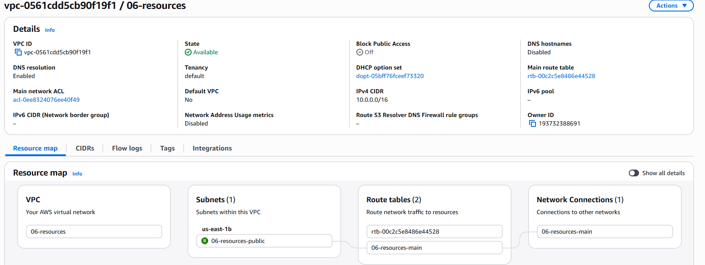
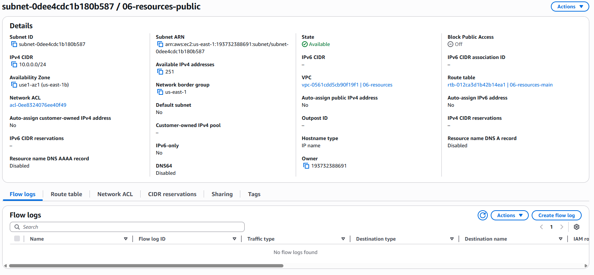
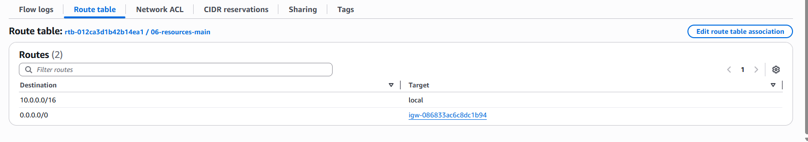
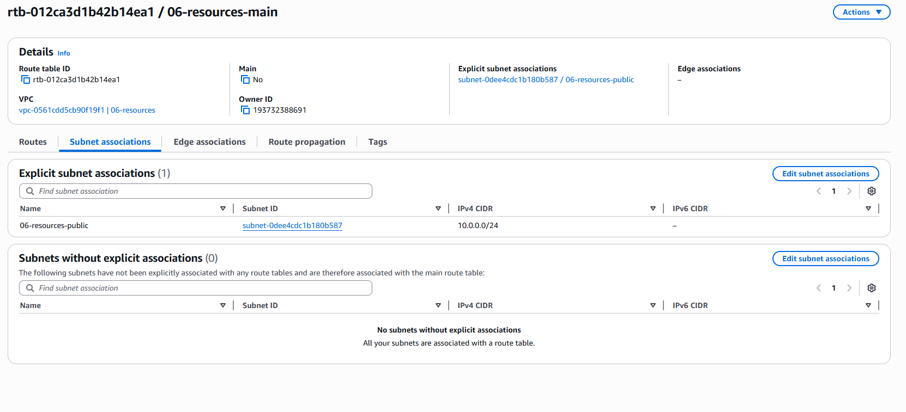
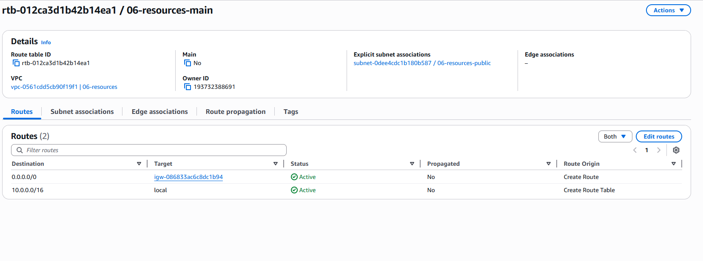
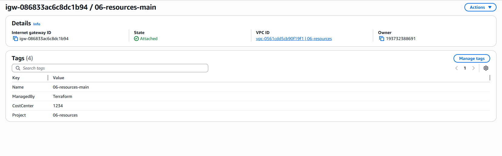
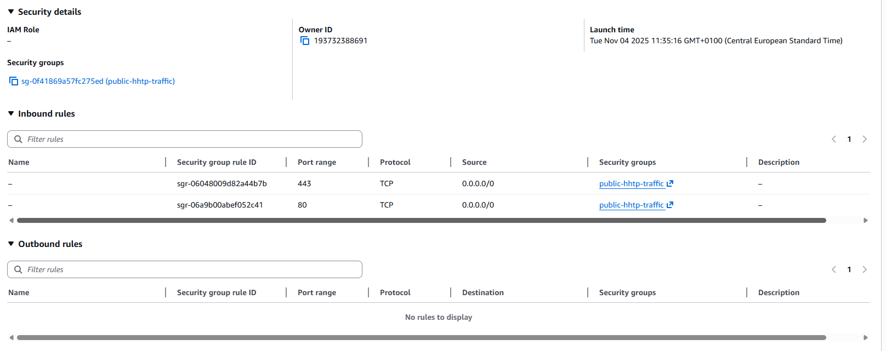
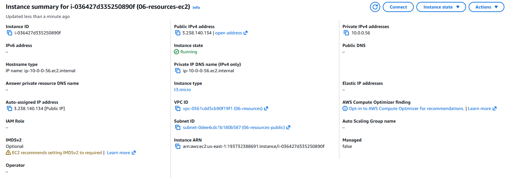
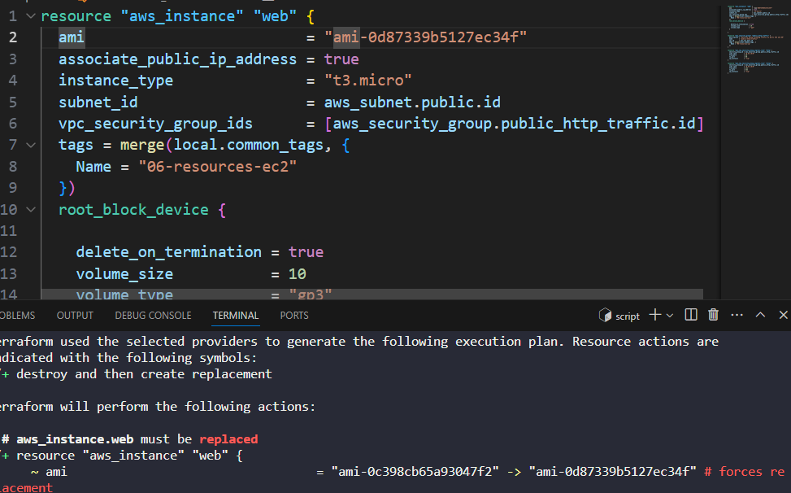
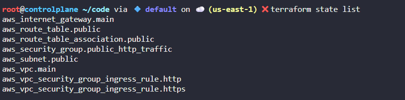

Steps for implementation:

1. [DONE] Deploy a VPC and a subnet
2. [DONE] Deploy an internet gateway and associate it with the VPC
3. [DONE] Setup a route table with a route to the IGW and associate it with the subnet
4. [DONE] Deploy an EC2 instance inside of the created subnet and associate a public IP
5. [DONE] Associate a security group that allows public ingress
6. [DONE] Change the EC2 instance to use a publicly available NGINX AMI
7. [DONE] Destroy everything

