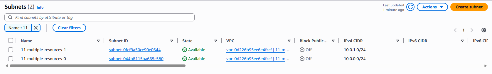
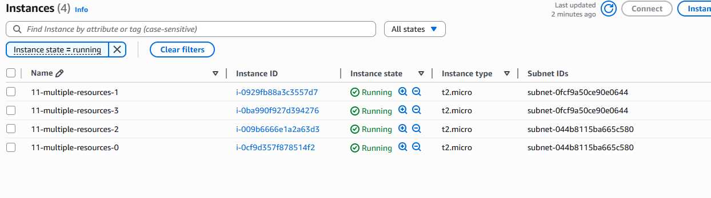
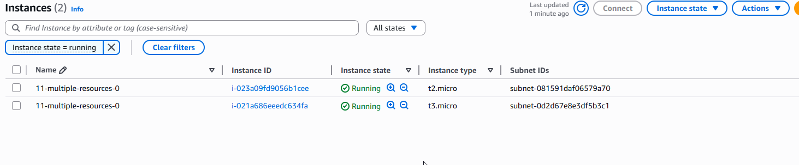
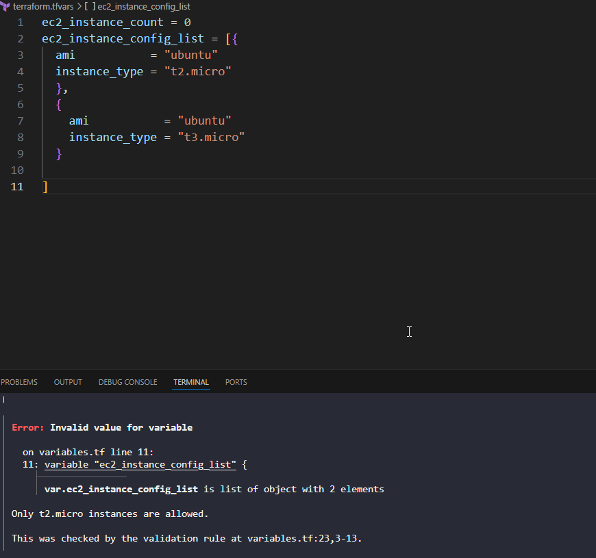

### Creating multiple subnets using count




### Creating multiple EC2 instances using count index(round robin strategy)




### Creating multiple EC2 instances using list giving 2 different instance type defined in terrafrom.tfvars file
```
ec2_instance_count = 0
ec2_instance_config_list = [{
  ami           = "ubuntu"
  instance_type = "t2.micro"
  },
  {
    ami           = "ubuntu"
    instance_type = "t3.micro"
  }

]
```



### Validating if both the instance type are same or not

